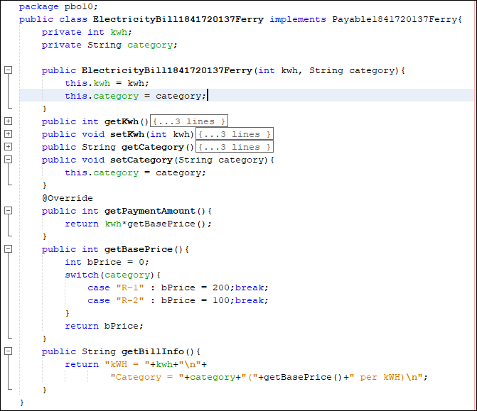
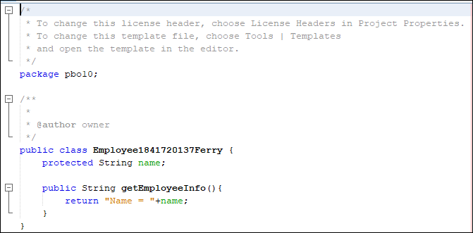
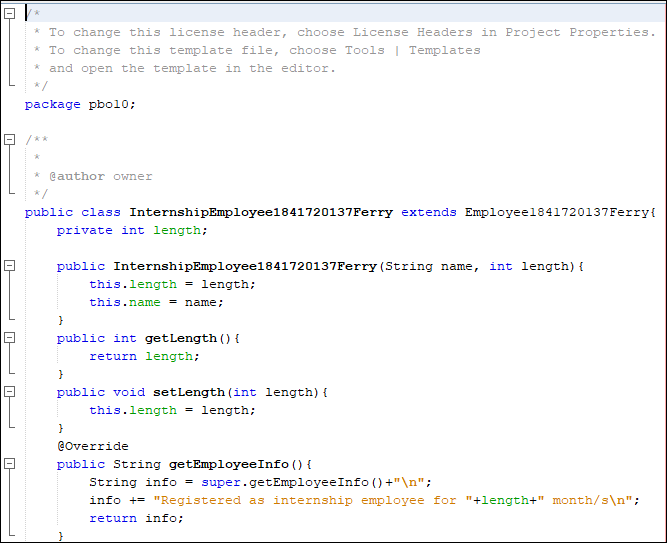
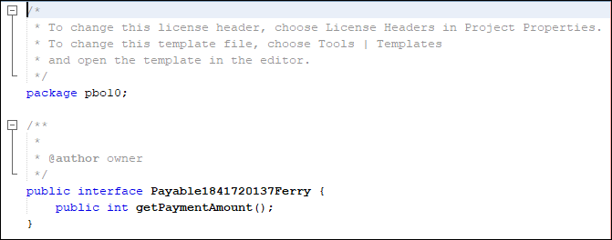
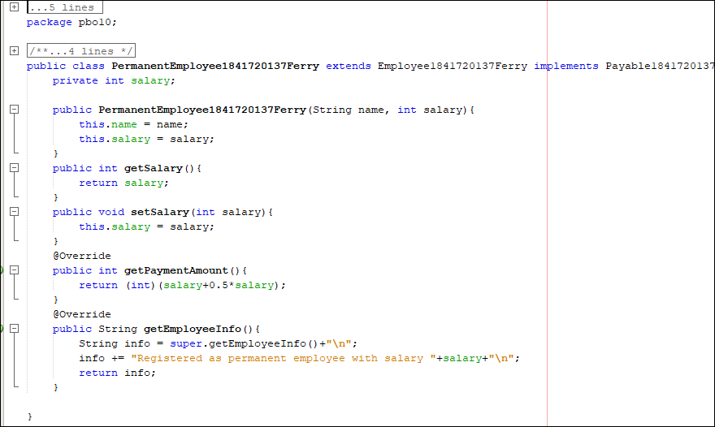
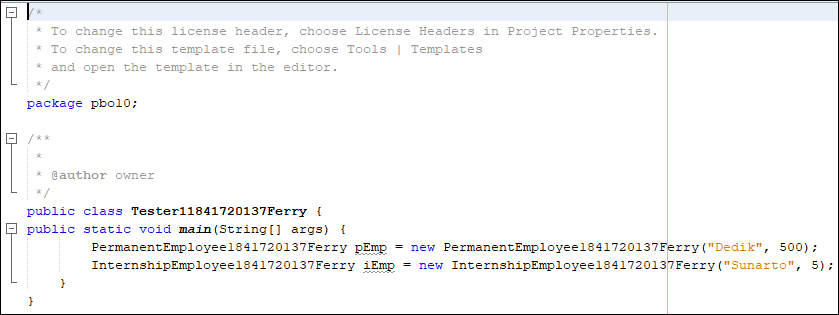
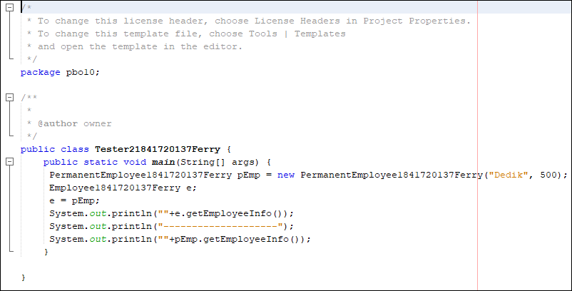
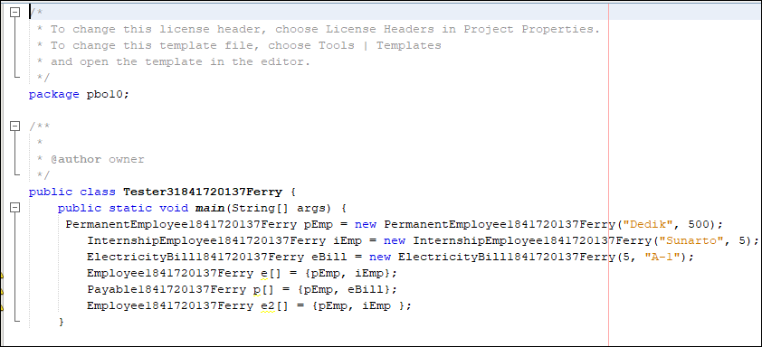
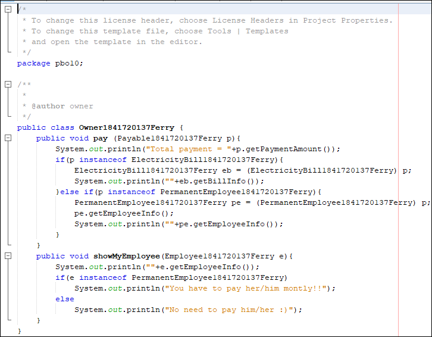
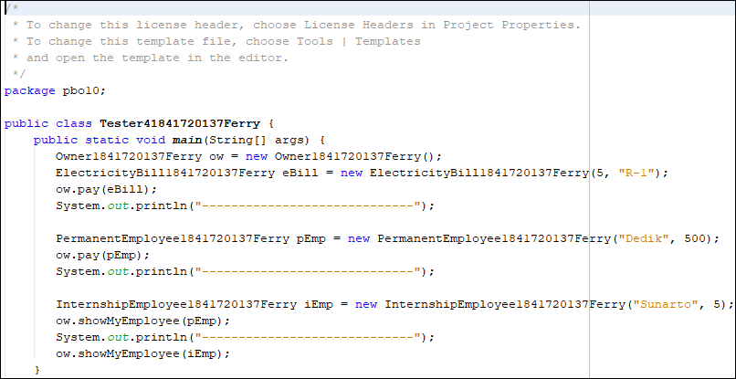

# Laporan Praktikum #10 - Polimorfisme

## Kompetensi
Setelah melakukan percobaan pada jobsheet ini, diharapkan mahasiswa mampu: 
1. Memahami konsep dan bentuk dasar polimorfisme 
2. Memahami konsep virtual method invication 
3. Menerapkan polimorfisme pada pembuatan heterogeneous collection 
4. Menerapkan polimorfisme pada parameter/argument method 
5. Menerapkan object casting untuk meng-ubah bentuk objek 

## Ringkasan Materi
     Polimorfisme merupakan kemampuan suatu objek untuk memiliki banyak bentuk. Penggunaan polimorfisme yang paling umum dalam OOP terjadi ketika ada referensi super class yang digunakan untuk merujuk ke objek dari sub class. Dengan kata lain, ketika ada suatu objek yang dideklarasikan dari super class, maka objek tersebut bisa diinstansiasi sebagai objek dari sub class. Dari uraian tersebut bisa dilihat bahwa konsep polimorfisme bisa diterapkan pada class-class yang memiliki relasi inheritance (relasi generalisasi atau IS-A)    

## Praktikum

### Percobaan 1

Link: [ ke ElectricityBill](../../src/10_Polimorfisme/ElectricityBill1841720137Ferry.java)

Link: [ ke Employee](../../src/10_Polimorfisme/Employee.java)

Link: [ ke InternshipEmployee](../../src/10_Polimorfisme/InternshipEmployee1841720137Ferry.java)

Link: [ ke Payable](../../src/10_Polimorfisme/Payable1841720137Ferry.java)

Link: [ ke PermanentEmployee](../../src/10_Polimorfisme/PermanentEmployee1841720137Ferry.java)

Link: [ ke Tester 1](../../src/10_Polimorfisme/Tester11841720137Ferry.java)

## Pertanyaan

1. Class apa sajakah yang merupakan turunan dari class Employee? 
2. Class apa sajakah yang implements ke interface Payable? 
3. Perhatikan class Tester1, baris ke-10 dan 11. Mengapa e, bisa diisi 
    dengan objek pEmp (merupakan objek dari class PermanentEmployee) dan objek iEmp (merupakan objek dari class InternshipEmploye) ?  
4. Perhatikan class Tester1, baris ke-12 dan 13. Mengapa p, bisa diisi 
    dengan objek pEmp (merupakan objek dari class PermanentEmployee) dan objek eBill (merupakan objek dari class ElectricityBill) ? 
5. Coba tambahkan sintaks: 
    p = iEmp;
    e = eBill;
pada baris 14 dan 15 (baris terakhir dalam method main) ! Apa yang menyebabkan error? 
6. Ambil kesimpulan tentang konsep/bentuk dasar polimorfisme!

## Percobaan 2

Link: [ ke  Tester 2](../../src/10_Polimorfisme/Tester21841720137Ferry.java)

## Pertanyaan

 1. Perhatikan class Tester2 di atas, mengapa pemanggilan e.getEmployeeInfo() pada baris 8 dan pEmp.getEmployeeInfo() pada baris 10 menghasilkan sama?
 2. Mengapa pemanggilan method e.getEmployeeInfo() disebut sebagai pemanggilan method virtual (virtual method invication), sedangkan pEmp.getEmployeeInfo() tidak?
 3. Jadi apakah yang dimaksud dari virtual method invocation? Mengapa disebut virtual?

 ## Percobaan 3

Link: [ ke  Tester 3](../../src/10_Polimorfisme/Tester31841720137Ferry.java)

 ## Pertanyaan

 1. Perhatikan array e pada baris ke-8, mengapa ia bisa diisi dengan objek-objek dengan tipe yang berbeda, yaitu objek pEmp (objek dari PermanentEmployee) dan objek iEmp (objek dari InternshipEmployee) ?

 2. Perhatikan juga baris ke-9, mengapa array p juga biisi dengan objekobjek dengan tipe yang berbeda, yaitu objek pEmp (objek dari PermanentEmployee) dan objek eBill (objek dari ElectricityBilling) ?
 
 3. Perhatikan baris ke-10, mengapa terjadi error? 

 ## Percobaan 4

Link: [ ke  Owner](../../src/10_Polimorfisme/Owner1841720137Ferry.java)

Link: [ ke  Tester 4](../../src/10_Polimorfisme/Tester41841720137Ferry.java)

 ## Pertanyaan

1. Perhatikan class Tester4 baris ke-7 dan baris ke-11,mengapa pemanggilan ow.pay(eBill) dan ow.pay(pEmp) bisa dilakukan, padahal jika diperhatikan method pay() yang ada di dalam class Owner memiliki argument/parameter bertipe Payable? Jika diperhatikan lebih detil eBill merupakan objek dari 
ElectricityBill dan pEmp merupakan objek dari PermanentEmployee?

2. Jadi apakah tujuan membuat argument bertipe Payable pada method pay() yang ada di dalam class Owner?

3. Coba pada baris terakhir method main() yang ada di dalam class Tester4 ditambahkan perintah ow.pay(iEmp);Mengapa terjadi error?

4. Perhatikan class Owner, diperlukan untuk apakah sintaks p instanceof ElectricityBill pada baris ke-6 ?

5. Perhatikan kembali class Owner baris ke-7, untuk apakah casting objek disana (ElectricityBill eb = (ElectricityBill) p) diperlukan ? Mengapa objek p yang bertipe Payable harus di-casting ke dalam objek eb yang bertipe ElectricityBill ?

## Tugas

## Kesimpulan

## Pernyataan Diri

Saya menyatakan isi tugas, , dan laporan praktikum ini dibuat oleh saya sendiri. Saya tidak melakukan plagiasi, kecurangan, menyalin/menggandakan milik orang lain.

Jika saya melakukan plagiasi, kecurangan, atau melanggar hak kekayaan intelektual, saya siap untuk mendapat sanksi atau hukuman sesuai peraturan perundang-undangan yang berlaku.

Ttd,

***(Ferry Maulana)***