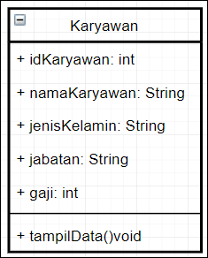
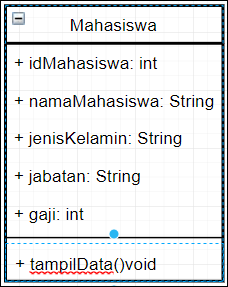
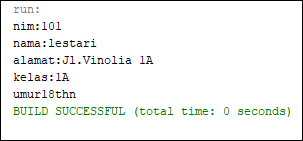
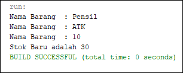
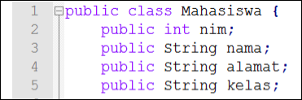
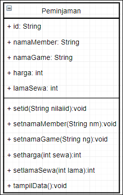
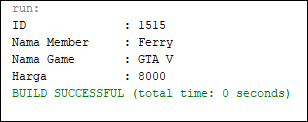
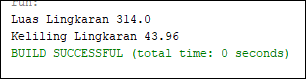
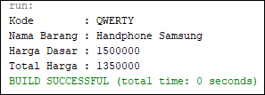

# Laporan Praktikum #3 - Enkapsulasi

## Kompetensi

- Mahasiswa dapat memahami deskripsi dari class dan object 
- Mahasiswa memahami implementasi dari class 
- Mahasiswa dapat memahami implementasi dari attribute
 - Mahasiswa dapat memahami implementasi dari method 
- Mahasiswa dapat memahami implementasi dari proses  instansiasi 
- Mahasiswa dapat memahami implementasi dari try-catch
 - Mahasiswa dapat memahami proses pemodelan class diagram menggunakan UML 

## Ringkasan Materi
> Object adalah instance dari class. Jika class secara umum mepresentasikan (template) sebuah object, sebuah instance adalah representasi nyata dari class itu sendiri

>Class merupakan suatu blueprint atau cetakan untuk menciptakan suatu instant dari  object. class juga merupakan grup suatu object dengan kemiripan attributes/properties, behaviour dan relasi ke object lain.

## Percobaan

### Percobaan 1

### Percobaan 2

link kode program : [link ke kode program Mahasiswa](../../src/2_Class_dan_Object/Mahasiswa1841720137Ferry.java)

link kode program : [link ke kode program Tes Mahasiswa](../../src/2_Class_dan_Object/TestMahasiswa1841720137Ferry.java)

### Percobaan 3

link kode program : [link ke kode program Barang](../../src/2_Class_dan_Object/Barang1841720137Ferry.java)

link kode program : [link ke kode program Tes Barang](../../src/2_Class_dan_Object/TestBarang1841720137Ferry.java)

## Pertanyaan

1.Studi Kasus 1
 1. Sebutkan Class apa saja yang bisa dibuat dari         studi kasus 1!,
        > Karyawan, Mahasiswa

2. Sebutkan atribut beserta tipe datanya yang dapat diidentifikasi dari masing-masing class dari studi kasus 1! 
        > int : id, gaji
        String : nama, jenis kelamin, jabatan 

3. Sebutkan method-method yang sudah anda buat dari masing-masing class pada studi kasus 1! 
        >tampilData()void

2.Studi Kasus 2 
 1. Jelaskan pada bagian mana proses pendeklarasian      atribut pada program diatas!
        
        
    2. Jelaskan pada bagian mana proses pendeklarasian method pada program diatas! 
        > public void tampilBiodata()

    3. Berapa banyak objek yang di instansiasi pada program diatas! 
        > 4

    4. Apakah yang sebenarnya dilakukan pada sintaks program “mhs1.nim=101” ? 
        > mengisis nim menjadi 101

    5. Apakah yang sebenarnya dilakukan pada sintaks program “mhs1.tampilBiodata()” ? 
        > menjalankan method tampilBiodata dari class mahasiswa

3.  1. Apakah fungsi argumen dalam suatu method? 
        >untuk memberi nilai saat fungsi di panggil

    2. Ambil kesimpulan tentang kegunaan dari kata kunci return , dan kapan suatu method harus memiliki return!
        >untuk mengambil nilai kembalian, saat suatu method diperlukan nilai akhirnya untuk method lain
        

## Tugas

1.

2.

link kode program : [link ke kode program Tugas Sewa](../../src/2_Class_dan_Object/Sewa1841720137Ferry.java)

link kode program : [link ke kode program Tugas Sewa](../../src/2_Class_dan_Object/SewaDemo1841720137Ferry.java)

3.

link kode program : [link ke kode program Tugas Lingkaran](../../src/2_Class_dan_Object/Lingkaran1841720137Ferry.java)

link kode program : [link ke kode program Tugas Lingkaran](../../src/2_Class_dan_Object/LingkaranDemo1841720137Ferry.java)

4.

link kode program : [link ke kode program Tugas Barang](../../src/2_Class_dan_Object/BarangDua1841720137Ferry.java)

link kode program : [link ke kode program Tugas Barang](../../src/2_Class_dan_Object/BarangDuaDemo1841720137Ferry.java)

## Kesimpulan

## Pernyataan Diri

Saya menyatakan isi tugas, kode program, dan laporan praktikum ini dibuat oleh saya sendiri. Saya tidak melakukan plagiasi, kecurangan, menyalin/menggandakan milik orang lain.

Jika saya melakukan plagiasi, kecurangan, atau melanggar hak kekayaan intelektual, saya siap untuk mendapat sanksi atau hukuman sesuai peraturan perundang-undangan yang berlaku.

Ttd,

***(Ferry Maulana)***