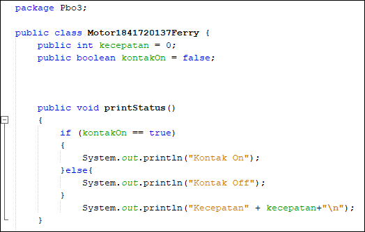
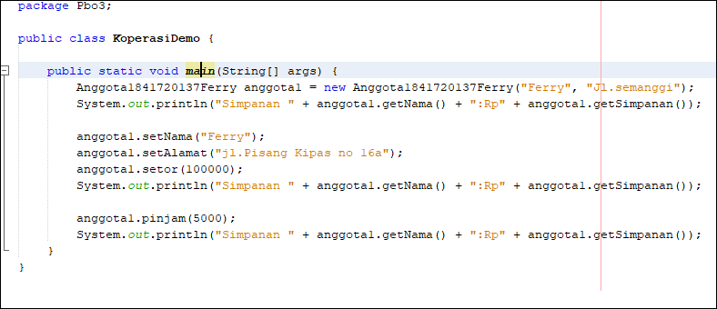
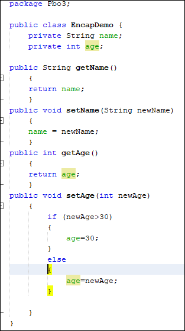

# Laporan Praktikum #3 - Class dan Object

## Kompetensi

Setelah melakukan percobaan pada modul ini, mahasiswa memahami konsep:
1. Konstruktor
2. Akses Modifier
3. Atribut/method pada class
4. Intansiasi atribut/method
5. Setter dan getter
6. Memahami notasi pada UML Class Diagram

## Ringkasan Materi
> Enkapsukasi disebut juga dengan information-hiding. Dalam berinteraksi dengan objek, seringkali
kita tidak perlu mengetahui kompleksitas yang ada didalamnya

## Percobaan

### Percobaan 1

### Percobaan 2

link kode program : [link ke kode program Motor](../../src/3_Enkapsulasi/Motor1841720137Ferry.java)

link kode program : [link ke kode program Motor Demo](../../src/3_Enkapsulasi/MotorDemo1841720137Ferry.java)

### Pertayaan
1. Pada class TestMobil, saat kita menambah kecepatan untuk pertama kalinya, mengapa
muncul peringatan “Kecepatan tidak bisa bertambah karena Mesin Off!”?
    > karena dalam fungsi tambahKecepatan kontakOn bernilai false
2. Mengapat atribut kecepatan dan kontakOn diset private?
    > untuk menyembunyikan atribut dari class lain
3. Ubah class Motor sehingga kecepatan maksimalnya adalah 100!
    >
    

### Percobaan 3

link kode program : [link ke kode program ](../../src/3_Enkapsulasi/Anggota1841720137Ferry.java)

link kode program : [link ke kode program  ](../../src/3_Enkapsulasi/KoperasiDemo.java)

## Pertanyaan 3 & 4
1. Apa yang dimaksud getter dan setter?
    > getter : fungsi untuk mendapatkan nilai

    > Setter : fungsi untuk memberi nilai

2. Apa kegunaan dari method getSimpanan()?
    > mendapatkan nilai dari simpanan

3. Method apa yang digunakan untk menambah saldo?
    > setor()

4. Apa yand dimaksud konstruktor?
    >

5. Sebutkan aturan dalam membuat konstruktor?
    >nama yang sama seperti nama class

    >tidak memiliki tipe return

    > tidak boleh menggunakan modifier abstract,static,final,dan synchronized

6. Apakah boleh konstruktor bertipe private?
    >boleh

7. Kapan menggunakan parameter dengan passsing parameter?
    >saat akan menentukan / memberi suatu nilai yang merubah nilai pada fungsi yang di jalankan

8. Apa perbedaan atribut class dan instansiasi atribut?
    >class : method yang belum berisi nilai

    >instansiasi atribut : pemanggilan dan pengisian nilai pada atribut

9. Apa perbedaan class method dan instansiasi method? 
    >class : method yang belum berisi nilai

    >instansiasi method : pemanggilan dan pengisian nilai pada method

## Tugas

1.

link kode program : [link ke kode program Tugas ](../../src/3_Enkapsulasi/EncapDemo.java)

link kode program : [link ke kode program Tugas ](../../src/3_Enkapsulasi/EncapTest.java)

2. Pada program diatas, pada class EncapTest kita mengeset age dengan nilai 35, namun pada saat ditampilkan ke layar nilainya 30, jelaskan mengapa.
    > Karena tidak memenuhi syarat if
3. 

link kode program : [link ke kode program Tugas Sewa](../../src/3_Enkapsulasi/EncapDemo.java)

4. 

link kode program : [link ke kode program Tugas Sewa](../../src/3_Enkapsulasi/AnggotaTugas.java)

link kode program : [link ke kode program Tugas Sewa](../../src/3_Enkapsulasi/TestKoperasi.java)

## Kesimpulan
>Dari percobaan diatas, telah dipelajari kosep dari enkapsulasi, kontruktor, access modifier yang
terdiri dari 4 jenis yaitu public, protected, default dan private. Konsep atribut atau method class
yang ada di dalam blok code class dan konsep instansiasi atribut atau method. Cara penggunaan
getter dan setter beserta fungsi dari getter dan setter. Dan juga telah dipelajari atau memahami
notasi UML

## Pernyataan Diri

Saya menyatakan isi tugas, kode program, dan laporan praktikum ini dibuat oleh saya sendiri. Saya tidak melakukan plagiasi, kecurangan, menyalin/menggandakan milik orang lain.

Jika saya melakukan plagiasi, kecurangan, atau melanggar hak kekayaan intelektual, saya siap untuk mendapat sanksi atau hukuman sesuai peraturan perundang-undangan yang berlaku.

Ttd,

***(Ferry Maulana)***