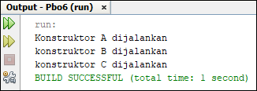
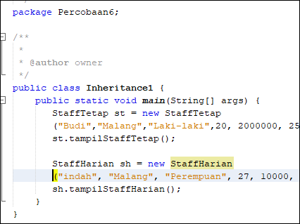

# Laporan Praktikum #6 - Inheritance

## Kompetensi
1. Memahami	konsep dasar inheritance atau pewarisan.
2. Mampu membuat suatu subclass dari suatu superclass tertentu.
3. Mampu mengimplementasikan konsep single dan	multilevel inheritance.
4. Mampu membuat objek dari suatu	subclass	dan	melakukan pengaksesan terhadap atribut	
dan	method	baik yang dimiliki sendiri atau turunan	dari superclass	nya.

## Ringkasan Materi
* Inheritence atau pewarisan sifat merupakan cara untuk menurunkan suatu Class yang lebih umum menjadi suatu kelas yang lebih spesifik. Inheritence adalah salah satu ciri utama suatu program bahasa yang berorientasi pada objek. Inti dari pewarisan adalah sifat yang reusable dari konsep Object oriented. Setiap subclass akan “mewarisi” sifat dari subclass selama bersifat protected ataupun publik. Dalam Inheritence ada dua istilah yang sering digunakan. Kelas yang menurunkan
disebut kelas dasar (base class/ super class), sedangkan kelas yang diturunkan disebut kelas turunan
(derived class/ sub kelas / child class). Di dalam Java untuk mendeklarasikan suatu kelas sebagai
subclass dilakukan dengan cara menambahkan kata kunci Extends setelah deklarasi nama kelas,
kemudian diikuti dengan nama parent-nya.

## Percobaan

### Percobaan 1

link kode program : [link ke kode program ClassA](../../src/6_Inheritance/ClassA.java)

link kode program : [link ke kode program ClassB](../../src/6_Inheritance/ClassA.java)

link kode program : [link ke kode program Percobaan1](../../src/6_Inheritance/ClassA.java)

### Pertanyaan
1. Pada	percobaan	1	diatas	program	yang	dijalankan	terjadi	error,	kemudian	perbaiki	sehingga	
program	tersebut	bisa	dijalankan	dan	tidak	error!
    >
2. Jelaskan	apa	penyebab	program pada	percobaan	1	ketika	dijalankan	terdapat	error!
    >Karena dalan sublass CLassB tidak terdapat extends dari ClassA

### Percobaan 2

link kode program : [link ke kode program ClassA](../../src/6_Inheritance/Coba2/ClassA.java)

link kode program : [link ke kode program ClassB](../../src/6_Inheritance/Coba2/ClassB.java)

link kode program : [link ke kode program Percobaan2](../../src/6_Inheritance/Coba2/Percobaan2.java)

### Pertanyaan
1. Pada	percobaan 2 diatas program yang dijalankan terjadi	error,	kemudian perbaiki sehingga program	tersebut bisa dijalankan dan tidak error!
    >Dengan menambah extends di kelasB
2. Jelaskan	apa	penyebab program pada percobaan 2 ketika dijalankan terdapat error!
    >Karena dalan sublass CLassB tidak terdapat extends dari ClassA

### Percobaan 3

link kode program : [link ke kode program Bangun](../../src/6_Inheritance/Coba3/Bangun.java)

link kode program : [link ke kode program Tabung](../../src/6_Inheritance/Coba3/Tabung.java)

link kode program : [link ke kode program Percobaan2](../../src/6_Inheritance/Coba3/Percobaan3.java)

### Pertanyaan
1. Jelaskan	fungsi “super” pada	potongan program	berikut	di class Tabung!
    > digunakan untuk mengambil nilai

2. Jelaskan	fungsi	“super”	dan	“this”	pada	potongan program di	class	Tabung!
    >Super  : menggambil nilai dari phi dan r

    >This   : digunakan untuk memperjelas bahwa yang di isi adalah t 

3. Jelaskan	mengapa	pada class Tabung tidak	dideklarasikan	atribut	“phi” dan “r”	tetapi	class tersebut dapat mengakses atribut tersebut!
    >Karena class Tabung meng-extends class Bangun sehingga dia menjadi subclass dari class Bangun 

### Percobaan 4

link kode program : [link ke kode program ClassA](../../src/6_Inheritance/Coba4/ClassA.java)

link kode program : [link ke kode program ClassB](../../src/6_Inheritance/Coba4/ClassB.java)

link kode program : [link ke kode program ClassC](../../src/6_Inheritance/Coba4/ClassC.java)

link kode program : [link ke kode program Percobaan4](../../src/6_Inheritance/Coba4/Percobaan4.java)

### Pertanyaan
1. Pada	percobaan 4 sebutkan mana class	yang	termasuk superclass	dan	subclass, kemudian jelaskan	alasannya!
    >Super : ClassA

    >Subclass: ClassB dan ClassC

    >Alasan : karena Class B dan C mengextends classA

2. Ubahlah	isi	konstruktor	default	ClassC	seperti	berikut:Tambahkan kata super()	di	baris	Pertaman dalam konstruktor defaultnya. Coba jalankan kembali	class	Percobaan4	dan	terlihat tidak ada	perbedaan dari hasil outputnya!
    >

3. Ubahlah isi	konstruktor	default	ClassC	seperti	berikut:Ketika mengubah	posisi	super()	dibaris	kedua dalam kontruktor defaultnya	dan	terlihat ada error.	Kemudian kembalikan	super()	kebaris	pertama	seperti	sebelumnya,	maka errornya akan	hilang. Perhatikan	hasil keluaran	ketika	class Percobaan4 dijalankan.	Kenapa	bisa	tampil	output
seperti	berikut	pada saat instansiasi	objek test dari class	ClassC
    >Karena sama

4. Apakah	fungsi	super()	pada	potongan	program	dibawah	ini	di	ClassC!
    > super() Akan memanggil constructor tanpa argumen dari superclass

### Percobaan 5

link kode program : [link ke kode program Karyawan](../../src/6_Inheritance/Coba5/Karyawan.java)

link kode program : [link ke kode program Manager](../../src/6_Inheritance/Coba5/Manager.java)

link kode program : [link ke kode program Staff](../../src/6_Inheritance/Coba5/Staff.java)

link kode program : [link ke kode program Inheretance1](../../src/6_Inheritance/Coba5/Inheretance1.java)

### Pertanyaan
1. Sebutkan	class	mana	yang	termasuk	super	class	dan	sub	class	dari	percobaan	1	diatas!
    > Super : Karyawan

    > Subclass : Manager dan Staff

2. Kata	kunci	apakah	yang	digunakan	untuk	menurunkan	suatu	class	ke	class	yang	lain?
    > Extends

3. Perhatikan	kode	program	pada	class	Manager,	atribut	apa	saja	yang	dimiliki	oleh	class tersebut?	Sebutkan	atribut	mana	saja	yang	diwarisi	dari	class	Karyawan!
    > tunjangan

    > gaji

4. Jelaskan	kata	kunci	super	pada	potongan	program	dibawah	ini	yang	terdapat	pada	class	
Manager!
    > mengambil nilai dari gaji

5. Program	pada	percobaan	1	diatas	termasuk	dalam	jenis	inheritance	apa?	Jelaskan alasannya!
    > 

### Percobaan 6

link kode program : [link ke kode program StaffTetap](../../src/6_Inheritance/Coba6/StaffTetap.java)

link kode program : [link ke kode program Staff Harian](../../src/6_Inheritance/Coba6/StaffHarian.java)

link kode program : [link ke kode program Inheretance1](../../src/6_Inheritance/Coba6/Inheretance1.java)

### Pertanyaan

1. Berdasarkan	class	diatas	manakah	yang	termasuk	single	inheritance	dan	mana	yang	
termasuk	multilevel	inheritance?
    > Single inheritence

2. Perhatikan	kode	program	class	StaffTetap	dan	StaffHarian,	atribut	apa	saja	yang	dimiliki	oleh class	tersebut?	Sebutkan	atribut	mana	saja	yang	diwarisi	dari	class	Staff!
    > golongan, asuransi ,jml jam kerja

3. Apakah	fungsi	potongan	program	berikut	pada	class	StaffHarian
    > mengambil nilai dari (nama,alamat, jk,umur dll) dari class staff

4. Apakah	fungsi	potongan	program	berikut	pada	class	StaffHarian
    >pada class staffHarian akan menampilkan data dari class staff
    
5. Perhatikan	kode	program	dibawah	ini	yang	terdapat	pada	class	StaffTetap Terlihat	dipotongan	program	diatas	atribut	gaji lembur	dan	potongan	dapat	diakses langsung.	Kenapa	hal	ini	bisa	terjadi	dan	bagaimana	class	StaffTetap	memiliki	atribut	gaji,	
lembur,	dan	potongan	padahal	dalam	class	tersebut	tidak	dideklarasikan	atribut	gaji,	lembur,dan	potongan?
    >karena class StaffTetap mengextend atribu dari class Staff

## Tugas

link kode program : [link ke kode program Komputer](../../src/6_Inheritance/Tugas/Komputer.java)

link kode program : [link ke kode program Laptop](../../src/6_Inheritance/Tugas/Laptop.java)

link kode program : [link ke kode program Pc](../../src/6_Inheritance/Tugas/Pc.java)

link kode program : [link ke kode program Mac](../../src/6_Inheritance/Tugas/Mac.java)

link kode program : [link ke kode program Windows](../../src/6_Inheritance/Tugas/Windows.java)

link kode program : [link ke kode program Main](../../src/6_Inheritance/Tugas/Running.java)

## Kesimpulan
> Ketika membuat objek dari subclass, pada saat itu juga objek pada superclass juga akan terbentuk.Dengan katalain, ketika kontruktor subclass dijalankan untuk membuat objek,saat itu juga kontruktor superclass akan berjalan.

## Pernyataan Diri

Saya menyatakan isi tugas, kode program, dan laporan praktikum ini dibuat oleh saya sendiri. Saya tidak melakukan plagiasi, kecurangan, menyalin/menggandakan milik orang lain.

Jika saya melakukan plagiasi, kecurangan, atau melanggar hak kekayaan intelektual, saya siap untuk mendapat sanksi atau hukuman sesuai peraturan perundang-undangan yang berlaku.

Ttd,

***(Ferry Maulana)***