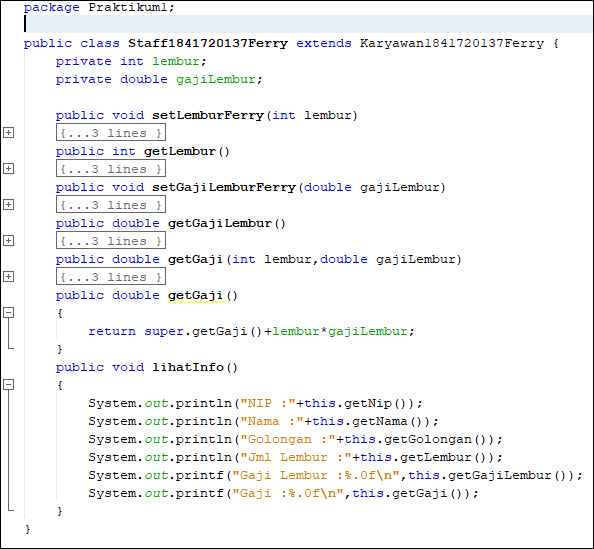

# Laporan Praktikum #7- Overriding dan Overloading

## Kompetensi
Setelah menempuh pokok bahasan ini, mahasiswa mampu :
  
1. Memahami konsep overloading dan overriding
2. Memahami perbedaan overloading dan overriding
3. Ketepatan dalam mengidentifikasi method overriding dan overloading
4. Ketepatan dalam mempraktekkan instruksi pada jobsheet
5. Mengimplementasikan method overloading dan overriding. 

## Ringkasan Materi
* Overloading  adalah menuliskan kembali method dengan nama yang sama pada suatu class. Tujuannya dapat memudahkan penggunaan/pemanggilan method dengan fungsionalitas yang mirip.
    * Untuk aturan pendeklarasian method Overloading sebagai berikut:
        * Nama method harus sama.
        *  Daftar parameter harus berbeda.
        * Return type boleh sama, juga boleh berbeda. 

*  Overriding  adalah Sublass yang berusaha memodifkasi tingkah laku yang diwarisi dari superclass. Tujuannya subclass dapat memiliki tingkah laku yang lebih spesifik sehingga dapat dilakukan dengan cara mendeklarasikan kembali method milik parent class di subclass. Deklarasi method pada subclass harus sama dengan yang terdapat di super class.
    * Kesamaan pada: 
        * Nama 
        * Return type (untuk return type : class A atau merupakan subclass dari class A) 
        * Daftar parameter (jumlah, tipe dan urutan)          

## Praktikum

### Percobaan 1

link kode program : [link ke kode program Karyawan](../../src/7_Overriding_dan_Overloading/Praktikum1/Karyawan1841720137Ferry.java)

link kode program : [link ke kode program Manager](../../src/7_Overriding_dan_Overloading/Praktikum1/Manager1841720137Ferry.java)

link kode program : [link ke kode program Staff](../../src/7_Overriding_dan_Overloading/Praktikum1/Staff1841720137Ferry.java)

link kode program : [link ke kode program Main](../../src/7_Overriding_dan_Overloading/Praktikum1/Main1841720137Ferry.java)

# Latihan 

1. Dari source coding diatas terletak dimanakah overloading? 

2. Jika terdapat overloading ada berapa jumlah parameter yang berbeda ? 
    * Beda 1

3. Dari source coding diatas terletak dimanakah overloading ?  
 
4. Jika terdapat overloading ada berapa tipe parameter yang berbeda ?
    * Beda 1

5. Dari source coding diatas terletak dimanakah overriding? 
 
6. Jabarkanlah apabila sourcoding diatas jika terdapat overriding? 
    * Terdapat swim di dua method

## Tugas

1. Overloading

2. Overriding

## Kesimpulan
1. Overloading
    * Nama method sama.
    * Parameter Berbeda.
    * Biasanya dalam satu class.

2. Overriding
    * Nama method sama.
    * Isi / Body method berbeda.
    * Biasanya berbeda class. interface dan implement.

## Pernyataan Diri

Saya menyatakan isi tugas, kode program, dan laporan praktikum ini dibuat oleh saya sendiri. Saya tidak melakukan plagiasi, kecurangan, menyalin/menggandakan milik orang lain.

Jika saya melakukan plagiasi, kecurangan, atau melanggar hak kekayaan intelektual, saya siap untuk mendapat sanksi atau hukuman sesuai peraturan perundang-undangan yang berlaku.

Ttd,

***(Ferry Maulana)***