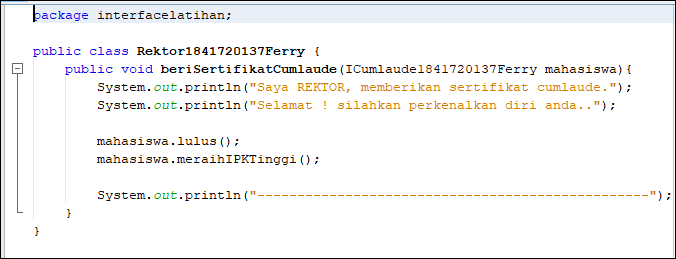
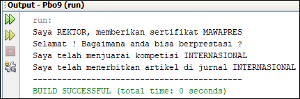

# Laporan Praktikum #9 - Abstract Class dan Interface

## Kompetensi
Setelah menyelesaikan lembar kerja ini mahasiswa diharapkan mampu:

1. Menjelaskan maksud dan tujuan penggunaan Abstract Class
2. Menjelaskan maksud dan tujuan penggunaan Interface 
3. Menerapkan Abstract Class dan Interface di dalam pembuatan program

## Ringkasan Materi
* Abstract Class Abstract Class adalah class yang tidak dapat diinstansiasi namun dapat di-extend. Abstract class baru dapat dimanfaatkan ketika ia di-extend. 
 
    * Karakteristik: 
        * Dapat memiliki properties dan methods seperti class biasa.
        * Selalu memiliki methods yang tidak memiliki tubuh (hanya deklarasinya saja), disebut juga abstract method.
        * Selalu dideklarasikan dengan menggunakan kata kunci abstract class. 

*  Interface Interface adalah struktur data yang hanya berisi abstract methods. Tidak ada apa-apa selain method abstract pada interface, termasuk atribut getter dan setter.  

    * Karakteristik: 
        * Tidak ada apa-apa di dalamnya selain abstract methods.
        * Di konvensi bahasa pemrograman Java, namanya dianjurkan untuk selalu diawali dengan huruf kapital ‘I’.
        * Selalu dideklarasikan dengan menggunakan kata kunci interface. 
        * Diimplementasikan dengan menggunakan kata kunci implements          

# Praktikum

### Percobaan 1

link kode program : [link ke kode program Hewan](../../src/9_Abstract_Class_dan_Interface/interfacelatihan/Hewan.java)

link kode program : [link ke kode program Ikan](../../src/9_Abstract_Class_dan_Interface/interfacelatihan/Ikan.java)

link kode program : [link ke kode program Kucing](../../src/9_Abstract_Class_dan_Interface/interfacelatihan/Kucing.java)

link kode program : [link ke kode program Orang](../../src/9_Abstract_Class_dan_Interface/interfacelatihan/Orang.java)

link kode program : [link ke kode program Program](../../src/9_Abstract_Class_dan_Interface/interfacelatihan/Program1841720137Ferry.java)

## Pertanyaan 

1. Bolehkah apabila sebuah class yang meng-extend suatu abstract class tidak mengimplementasikan method abstract yang ada di class induknya? Buktikan!

## Percobaan 2

link kode program : [link ke kode program IBerprestasi](../../src/9_Abstract_Class_dan_Interface/interfacelatihan/IBerprestasi.java)

link kode program : [link ke kode program ICumlaude](../../src/9_Abstract_Class_dan_Interface/interfacelatihan/ICumlaude.java)

link kode program : [link ke kode program Mahasiswa](../../src/9_Abstract_Class_dan_Interface/interfacelatihan/Mahsiswa.java)

link kode program : [link ke kode program PascaSarjana](../../src/9_Abstract_Class_dan_Interface/interfacelatihan/PascaSarjana.java)

link kode program : [link ke kode program Rektor](../../src/9_Abstract_Class_dan_Interface/interfacelatihan/Rektor.java)

link kode program : [link ke kode program Sarjana](../../src/9_Abstract_Class_dan_Interface/interfacelatihan/Sarjana.java)

link kode program : [link ke kode Program](../../src/9_Abstract_Class_dan_Interface/interfacelatihan/Program.java)

## Pertanyaan 

1. Mengapa pada langkah nomor 9 terjadi error? Jelaskan! 

2. Dapatkah method kuliahDiKampus() dipanggil dari objek sarjanaCumlaude di class Program? Mengapa demikian? 

3. Dapatkah method kuliahDiKampus() dipanggil dari parameter mahasiswa di method beriSertifikatCumlaude() pada class Rektor? Mengapa demikian? 

4. Modifikasilah method beriSertifikatCumlaude() pada class Rektor agar hasil eksekusi class Program menjadi seperti berikut ini:

## Percobaan 3

## Pertanyaan

1. Apabila Sarjana Berprestasi harus menjuarai kompetisi NASIONAL dan menerbitkan artikel di jurnal NASIONAL, maka modifikasilah class-class yang terkait pada aplikasi Anda agar di class Program objek pakRektor dapat memberikan sertifikat mawapres pada objek sarjanaCumlaude. 

## Kesimpulan

## Pernyataan Diri

Saya menyatakan isi tugas, kode program, dan laporan praktikum ini dibuat oleh saya sendiri. Saya tidak melakukan plagiasi, kecurangan, menyalin/menggandakan milik orang lain.

Jika saya melakukan plagiasi, kecurangan, atau melanggar hak kekayaan intelektual, saya siap untuk mendapat sanksi atau hukuman sesuai peraturan perundang-undangan yang berlaku.

Ttd,

***(Ferry Maulana)***